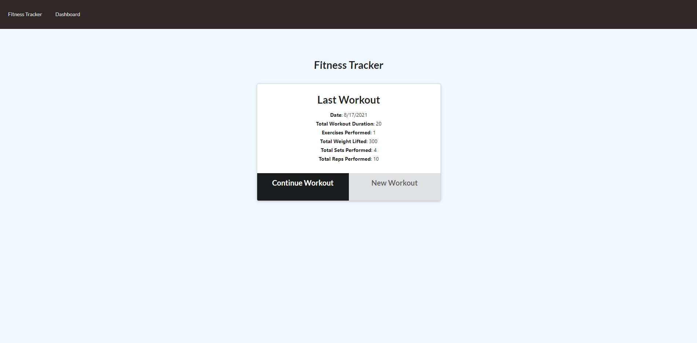
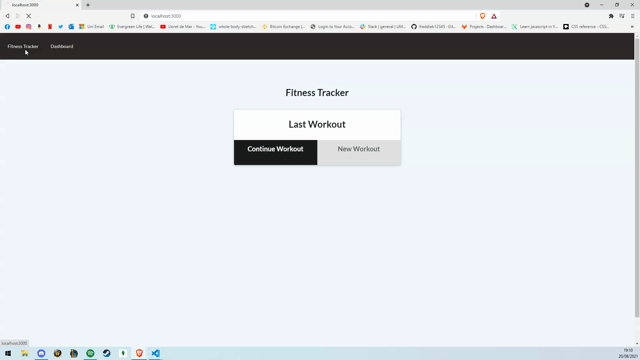
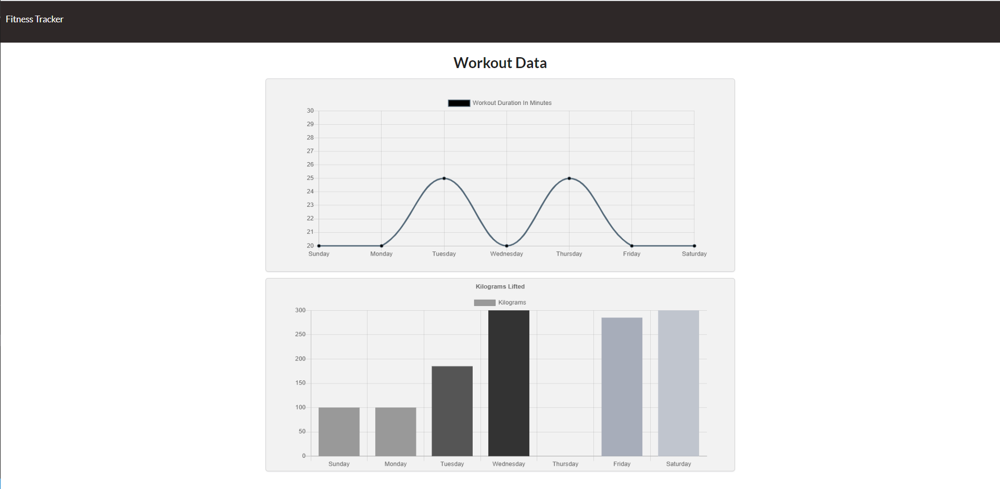

# Fitness Tracker

</br>
<p align="center">
    
    
    
       
    
    
    
    
      
      
      
</p>


## Description

Keep track of all your workouts for the week using Fitness Tracker. Fitness tracker logs all of your workouts for the week and displays them on your dashboard through 4 different graphs.

## Table of Contents

* [Installation](#installation)
* [Usage](#usage)
    * [Screenshots](#screenshots)
    * [Snippets](#snippets)
* [Credits](#credits)
* [License](#license)

## Installation

1. Clone repository. 
2. Check in routes/api-routes and comment in block of code if you want the database to be prepopulated with dummy values
3. npm install
4. node server.js

Running npm run seed allows you to have a prepopulated database.

<!-- <p align="center">
    <a href="https://track-your-fitness.herokuapp.com/"></a>
</p> -->


## Usage

### Screeshots

1. Homepage displaying last workout



2. Creating Workouts




3. Last Week's Summary



### Snippets


1. Adding to an array type

```javascript

    //API function to add an exercise
    app.put("/api/workouts/:id", (req, res) => {

        db.Workout.findOneAndUpdate(
            { _id: req.params.id },
            {
                $inc: { totalDuration: req.body.duration },
                $push: { exercises: req.body }
            },
            { new: true }).then(dbWorkout => {
                res.json(dbWorkout);
            }).catch(err => {
                res.json(err);
            });

    });
    
```
* The above function adds an exercise to the exercise array that has the spcific id from the current workout and update the specific fields within the workout. It also will add the duration of the exercise to the total duration of the workout.

## Credits

### Author

- Github: [freddieb12345](https://www.github.com/freddieb12345)

### Built With

</br>
<p align="center">
    <a href="https://developer.mozilla.org/en-US/docs/Web/HTML"></a>
    <a href="https://developer.mozilla.org/en-US/docs/Web/CSS"></a>
    <a href="https://www.javascript.com/"></a>
    <a href="https://getbootstrap.com/"></a>
    <a href="https://getbootstrap.com/"></a>
    <a href="https://nodejs.org/en/"></a>
    <a href="https://www.npmjs.com/package/express"></a>
    <a href="https://www.mongodb.com/"></a>
</p>

## License


</br>
<p align="center">
    
</p>
